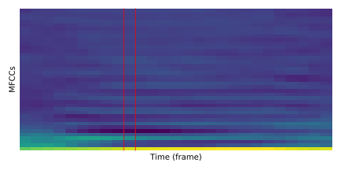

<h1 align="center">Speech Recognition on the Free Spoken Digit Dataset</h1>

    <a href="#dataset-description-and-classification-problem"><b>Dataset Description and Classification Problem</b></a> ·
    <a href="#methodology"><b>Methodology</b></a> ·
    <a href="#results"><b>Results</b></a> 
    <a href="#improvements">Improvements</a> ·
    <a href="#setup-and-requirements">Setup and Requirements</a> ·
    <a href="#resources">Resources</a>

This repository contains the code that I used to perform isolated word recognition on the Free Spoken Digit Dataset consisting of trimmed audio signals of spoken digits.

Although the dataset and audio classification task were relatively simple (with the chosen classifiers achieving high accuracies), the main areas of focus in this project were:

- Experimenting with PyTorch to broaden my knowledge of deep learning frameworks.
- Creating data loaders/generators to efficiently load and iterate through training and validation data batches of a specific dataset.
- Handling variable-length multivariate sequential data in PyTorch, using [`PackedSequence`](https://pytorch.org/docs/master/generated/torch.nn.utils.rnn.PackedSequence.html) objects for processing with RNNs.
- Using common audio feature extraction methods on raw mono signals to produce meaningful and discriminative representations such as [Mel-Frequency Cepstral Coefficients (MFCCs)](https://en.wikipedia.org/wiki/Mel-frequency_cepstrum) for speech recognition.
- Investigating the effectiveness of my recent DTW k-NN implementation (see Sequentia<a href="#ref-1">[1]</a>) on audio classification.

## Dataset Description and Classification Problem

The [Free Spoken Digit Dataset (FSDD)](https://github.com/Jakobovski/free-spoken-digit-dataset) is an open speech dataset consisting of audio recordings of the spoken digits 0-9 in English. The dataset is essentially a spoken version of the popular [MNIST dataset](http://yann.lecun.com/exdb/mnist/) which contains images of hand-written digits.

    
    
    
     
    Hand-written and spoken digit 7 from the MNIST and FSDD datasets, respectively<a href="#ref-2">[2]</a>. 

As of 29th May 2020, the dataset consists of 2000 recordings, with 50 of each digit for each of the four speakers.

### Classification Problem

In isolated word recognition, we are presented with separate recordings, each consisting of the utterance of a single word. The task is to determine the word that was uttered in each of the recordings, given the audio signal of the recording.

This is simply a classification task where we have:

- classes which represent words (or digits in the case of FSDD) 
  ,
- example-label pairs where each example is some digital representation of the recording audio 
  .

However, one difference is that rather than dealing with single feature vectors in multi-dimensional Euclidean space, our representation  is now a time series whose duration may differ from that of other recordings.

Depending on our representation of the audio (as we discuss below with MFCCs), these time series may be multivariate too.

## Methodology

There are many different ways to represent audio, including raw digital signals, spectrograms, chromagrams, scalograms and Mel-spectrograms. However, one of the most effective and frequently used representations in the domain of automatic speech recognition is **Mel-Frequency Cepstral Coefficients (MFCCs)**.

MFCCs are a collection of features that can be used to represent a section (or _frame_) of audio. The entire process of MFCC generation from the raw audio signal is detailed in [this brilliant blog post](https://haythamfayek.com/2016/04/21/speech-processing-for-machine-learning.html) by Haytham Fayek. The number of MFCCs to use is an adjustable hyper-parameter, but this is generally fixed to specific values such as 13 or 40.

For these experiments, I chose to use 39 MFCCs (40, but with the constant offset coefficient removed as described [here](https://musicinformationretrieval.com/mfcc.html)).

     
    MFCCs for the audio of a spoken digit. Each time frame (shown in red) is represented by a vector of 39 MFCCs.

### Classification Methods

<!-- TODO: Say something -->

#### Approximate Dynamic Time Warping k-Nearest Neighbors (DTW k-NN)

One of the most simple classification algorithms, and often the first one taught to those studying machine learning, is the **k-Nearest Neighbors (k-NN)** classifier. When classifying a test feature vector, a k-NN classifier does the following:

1. Computes the distance from the test point to every training point, using a measure such as Euclidean distance.
2. Assigns the test point to the most common class of the  nearest training points.

However, k-NN is not directly applicable to time series, as the Euclidean distance metric cannot be used to effectively measure the similarity between two time series of different length.

To apply k-NN to the task of audio classification, we need to introduce such a distance measure. [Dynamic Time Warping (DTW)](https://en.wikipedia.org/wiki/Dynamic_time_warping) is a dynamic programming algorithm that can align two variable-length univariate sequences. The algorithm can be extended to multivariate digital audio signal representations.

We use the Sequentia<a href="#ref-1">[1]</a> library which implements a fast DTW k-NN classifier using an approximate DTW implementation (see FastDTW<a href="#ref-4">[4]</a>) that aligns sequences in linear time.

    <a href="https://nbviewer.jupyter.org/github/eonu/fsdd/blob/master/notebooks/Approximate%20Dynamic%20Time%20Warping%20k-Nearest%20Neighbors.ipynb">
        <b>Click here to view the approximate DTW k-NN classifier notebook</b>
    </a>

#### Bidirectional Recurrent Neural Network with Long Short-Term Memory (BiLSTM-RNN)

The **Recurrent Neural Network (RNN)** is a type of neural network that is designed to handle sequential data of various length. RNNs work by feeding the input sequence into an RNN cell one time step at a time.

     
    RNN cell unfolded to accept an input sequence with  time steps.

For sequence classification, we typically only take the last hidden state vector  and use this for classification, effectively using it to represent the context of the entire sequence.

However, the vanilla RNN suffers from issues with vanishing gradients, effectively resulting in earlier parts of the input sequence being "forgotten". The **Recurrent Neural Network with Long Short-Term Memory (LSTM-RNN)** is a special way of defining a RNN cell by using _gates_ to allow the network to decide what information to remember, and for how long to remember it.

We can further improve the performance of RNNs by introducing the concept of _bidirectionality_. A **Bidirectional Recurrent Neural Network with Long Short-Term Memory (BiLSTM-RNN)** uses two cells: one to process the input sequence in the normal forward direction, and one to process the sequence backwards.

The diagram below shows the architecture that I used: a single-layer BiLSTM-RNN (using MFCCs as input), passing the final hidden state vector through a fully-connected layer and softmax layer for classification.

    

    <a href="https://nbviewer.jupyter.org/github/eonu/fsdd/blob/master/notebooks/Recurrent%20Neural%20Network%20with%20Long%20Short-Term%20Memory.ipynb">
        <b>Click here to view the BiLSTM-RNN notebook</b>
    </a>

## Results

The below hyper-parameter settings were found to be optimal (on the validation set):

- **DTW k-NN**
  -  (number of neighbors): **5**
  - FastDTW radius (see <a href="#ref-4">[4]</a> for more information): **10**
  - Distance weighting: **Uniform**
- **BiLSTM-RNN**
  - Batch size (unchanged): **64**
  - Number of epochs (unchanged): **15**
  - Learning rate (unchanged): **0.002** with the Adam learning rule<a href="#ref-5">[5]</a>.
  - Number of RNN layers (unchanged): **1**
  - Number of RNN hidden state dimensions: **50**
  - Number of units in fully-connected layer: **50**

These settings achieved the following test set results on an 80% training, 10% validation and 10% test set split:

| Model      | Test accuracy (%) |
| ---------- | ----------------- |
| DTW k-NN   | 98.41             |
| BiLSTM-RNN | 98.41             |

## Improvements

While promising results were achieved, this is likely as a result of the dataset being too simple. Below are a number of improvements that can be made, especially for more challenging datasets or audio classification tasks such as music genre classification.

- **Gated Recurrent Units**: The Gated Recurrent Unit (GRU) is an alternative to the LSTM cell which still allows for long-term dependencies to be remembered. However, GRUs are more computationally efficient as they do not have to keep an internal cell state (in addition to the hidden state) unlike LSTMs.
- **Recurrent drop-out**: The implemented LSTM uses drop-out after the recurrent layer and after the fully-connected layer. However, drop-out on the recurrent connections between time steps offers another form of regularization, improving the model's ability to generalize.
- **Multi-layer RNNs**: As with standard feed-forward neural networks, the representational power or learning capacity of RNNs can often be improved by adding more layers (i.e. feeding the output of one RNN cell into an RNN cell in the next layer).
- **CNN-LSTM**: As shown in diagrams above, MFCCs (as well as spectrograms) can be seen as a visual representation of audio. Convolutional Neural Networks (CNNs) are widely used in computer vision for learning features directly from images. One interesting approach to speech recognition could be to use CNNs to learn such features from the visual audio representation, and then feed these temporal features into a LSTM-RNN.
- **(log)-Mel spectrograms**: The Mel spectrogram is an alternative form of audio representation, which is actually obtained as an intermediate step towards generating MFCCs. At the time of their conception, MFCCs were developed to overcome the issue of the Mel spectrogram being highly-correlated (as a result of overlapping during the windowing stage). Highly-correlated features posed a challenge when used with _traditional_ speech recognition systems based on Hidden Markov Models and Gaussian Mixture Models. However, such features are not as problematic for neural networks, meaning that computing the full MFCCs may not be necessary.
- **Dynamic features**: MFCCs are a static representation of audio as they only capture information from a given frame. ∆ (delta) and ∆∆ (delta-delta) features are additional features that can be computed as the first and second order derivatives of the MFCCs, and can be combined with MFCCs to capture the dynamic nature of audio.
- **Data augmentation**: When using log Mel-spectrograms for speech recognition, data augmentation for audio signals is often done on two levels:
  - _Raw audio_: Transformations such as pitch shifting, time stretching, fading in/out, reverberation and white noise.
  - _Spectrogram_: Frequency and time masking (see SpecAugment<a href="#ref-6">[6]</a>).

## Setup and Requirements

Package management for this project was done with `conda` (v4.8.2) and `pip` (v20.0.2), running on **`python` v3.7.4**. Below are the required packages for the project:

- `jupyter` (v1.0.0)
- `tqdm` (v4.46.0)
- `librosa` (v0.7.2)
- `numpy` (v1.18.1)
- `sequentia` (v0.7.1)
- `scikit-learn` (v0.22.1)
- `matplotlib` (v3.1.3)
- `pytorch` (v1.5.0)
- `torchaudio` (v0.5.0)
- `torchvision` (v0.6.0)
- `pandas` (v1.0.3)
- `seaborn` (v0.10.1)

## References

<table>
    <tbody>
        <tr id="ref-1">
            <td>[1]</td>
            <td>
                <a href="https://github.com/eonu/sequentia">
                    Edwin Onuonga. <b>"sequentia: A machine learning interface for isolated temporal sequence classification algorithms in Python"</b> (2019)
                </a>
            </td>
        </tr>
        <tr id="ref-2">
            <td>[2]</td>
            <td>
                <a href="https://blog.otoro.net/2016/04/01/generating-large-images-from-latent-vectors/">
                    David Ha. <b>"Generating Large Images from Latent Vectors"</b> <code>blog.otoro.net</code> (2016)
                </a>
            </td>
        </tr>
        <tr id="ref-3">
            <td>[3]</td>
            <td>
                <a href="http://people.irisa.fr/Romain.Tavenard/?page=2">
                    Romain Tavenard. <b>"Machine Learning & Time Series"</b> (2016)
                </a>
            </td>
        </tr>
        <tr id="ref-4">
            <td>[4]</td>
            <td>
                <a href="https://pdfs.semanticscholar.org/05a2/0cde15e172fc82f32774dd0cf4fe5827cad2.pdf">
                    Stan Salvador, and Philip Chan. <b>"FastDTW: Toward accurate dynamic time warping in linear time and space"</b> Intelligent Data Analysis 11.5 (2007), 561-580.
                </a>
            </td>
        </tr>
        <tr id="ref-5">
            <td>[5]</td>
            <td>
                <a href="https://arxiv.org/pdf/1412.6980.pdf">
                    Diederik P. Kingma, and Jimmy Lei Ba. <b>"Adam: A Method For Stochastic Optimization"</b> Proceedings of the 3rd International Conference on Learning Representations (ICLR 2015).
                </a>
            </td>
        </tr>
        <tr id="ref-6">
            <td>[6]</td>
            <td>
                <a href="https://ai.googleblog.com/2019/04/specaugment-new-data-augmentation.html">
                    Daniel S. Park, William Chan, Yu Zhang, Chung-Cheng Chiu, Barret Zoph, Ekin D. Cubuk, Quoc V. Le. <b>"SpecAugment: A New Data Augmentation Method for Automatic Speech Recognition"</b> Google Brain (2019).
                </a>
            </td>
        </tr>
    </tbody>
</table>

## Contributors

<table>
	<thead>
		<tr>
			<th align="center">
                <a href="https://github.com/eonu">
                
                 <b>Edwin Onuonga</b>
                </a>
                 
                <a href="mailto:ed@eonu.net">✉️</a>
                <a href="https://eonu.net">🌍</a>
			</th>
		</tr>
	</thead>
</table>

---

  &copy; 2020-2021, Edwin Onuonga - Released under the <a href="https://opensource.org/licenses/MIT">MIT</a> License. 
  <em>Authored and maintained by Edwin Onuonga.</em>

